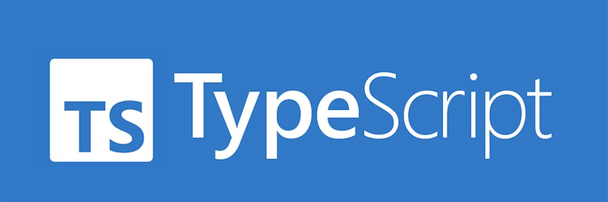

# TypeScript Course



Practices of TypeScript Course include util syntax information and examples of the languague.

## Run and Build

For run only change the file to work on `package.json` with `start` and `dev` scripts.

```json
{
  "scripts": {
    "build": "tsc",
    "start": "node practices/build/fileToWork.js",
    "dev": "ts-node-dev --respawn --transpile-only practices/fileToWork.ts"
  }
}
```

By default the `build` script compiles all files located in the `practices` folder into `practices/build`.
